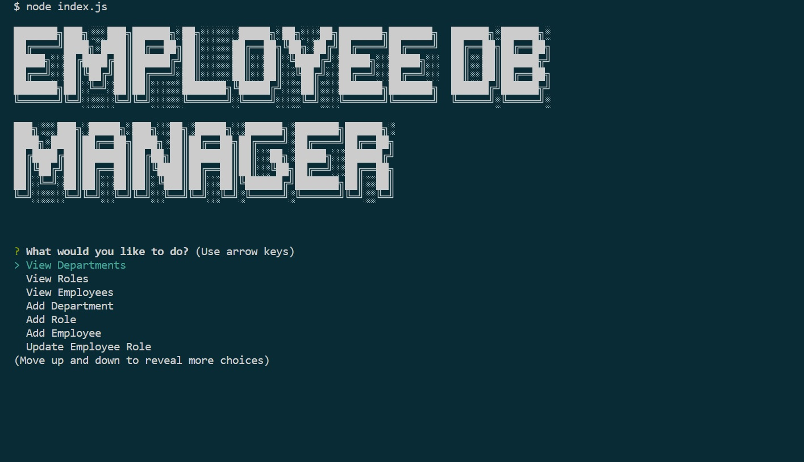

# Employee Database Manager   

  

## Table of Contents
-[Description](#description)  
-[Installation](#installation)  
-[Usage](#usage)  
-[Contributing](#contributing)  
-[Credits](#credits)  
-[License](#license)  
-[Questions](#questions)

## Description
This application was created for administrators to manage the database that keeps employee information. It allows anyone without technical experience to add, update, and view employee, role, and department information. This application makes use of node.js and the npm packages, inquirer version 8.2.4, mysql2, dotenv, and console.table.

## Installation
To install this application, first go to the folder for the app. Then type in 'npm i' to install npm to use the packages listed in the package.json file.

## Usage
[Usage Video](https://drive.google.com/file/d/10CIdiowJMQciTQqWvWDju6Nx-ZZDRgiw/view)  
To use this application, first make sure your terminal is located in the folder that holds the app. Then sign into the mysql shell and type 'SOURCE db/schema.sql' into the terminal. This will create the database being used in the app. If you want to use test data, type 'SOURCE db/seeds.sql' into the shell. This will populate the database's tables with test data. Then type 'node index.js' and press enter to start the application. You will then see a title show up in the console, and you will be asked to select from a list of options. The options to view departments, roles, and employees do just that. The 'view departments' choice displays a table with the department names on it. 'View Roles' displays a table with role id, role title, department, and salary as columns. 'View Employees' displays a table with employee id's, names, job title, department, salary, and manager name as columns. 'Add Department' prompts you to enter a new department name and adds it to the database. 'Add Role' prompts you to enter the name of the new role, then it prompts you to enter the role's salary, and then it prompts you to select the department it is in. It will then enter that role into the database. 'Add Employee' prompts you to enter the employee's first name, then last name. It then asks you to select the role for this employee, and then asks you to select their manager. It then adds this employee to the database. 'Update Employee Role' prompts you to select the employee to update. It then asks you to select their new role and updates the database. 'Update Employee Manager' prompts you to select the employee to update, then prompts you to select their new manager. It then updates that change to the database. 'View Employees By Manager' prompts you to select from a list of current managers, then it displays a table of employees under that manager with id's. 'View Budget By Department' prompts you to select a department. It then adds the salary of all employees in that department and displays a total budget for that department. 'View Employees By Department' prompts you to select a department. It then displays a table with the employee names, roles, and salaries for that department. To stop the application, press control+C on your keyboard.

## Contributing
To contribe, fork the project, create a branch to work on, edit tha branch, and then create a pull request. If the edits are approved, your contributions will be added. 

## Credits
This application uses references from a Uconn web development bootcamp in the following repo: https://git.bootcampcontent.com/University-of-Connecticut/CONN-VIRT-FSF-PT-07-2023-U-LOLC.git. The title that appears when the app loads is from the website: https://fsymbols.com/text-art/. There are also references made from the documentation for inquirer, mysql2, dotenv, console.table, and mysql.

## License
This project is not protected under any license.

## Questions
To view more of my work, view my GitHub profile: [adaking1](https://github.com/adaking1)

If you have any questions about this project please email me here: kinga1215@yahoo.com

